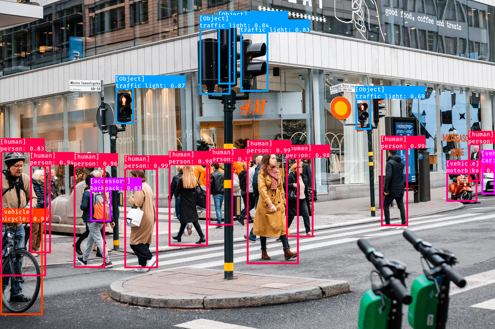

# Nvision Python SDK

> Nvision: Nipa Cloud Visual-based Machine Learning Services

Nvision enables machine learning services to extract insightful information from images with simple and easy to use APIs. Provide real-time video analysis with stream processing service. Get the most out of your visual information with the help of Nipa cloud experts. Offer fully customized algorithms to your specifications. [Learn more.](https://docs.nipa.cloud/article-categories/nvision/)

Nvision image processing is **synchronous**. The input requests and output responses are structured in JSON format. You can make a RESTful API call by sending the image as a base64 encoded string in the body of your request, see [RESTful and WebSocket](https://docs.nipa.cloud/knowledge-base/api-concepts/) API concepts.

## Installation

Using pypi package here: https://pypi.org/project/nvision/

```bash
pip install nvision
```

## Getting started

```python
import os
import json
import base64
from nvision import ObjectDetection

model = ObjectDetection(api_key=os.getenv('API_KEY'))

# base64 encoed string
with open(os.path.join('docs', 'street.jpg'), 'rb') as file:
    image = file.read()
    image = base64.b64encode(image).decode('utf-8')

# make a RESTful call to the Nvision API
response = model.predict(image)

print(response)
print(json.dumps(response.json(), indent=4, sort_keys=True))
```

## Prediction results

The API responses a list of labels with corresponding confidence scores of how likely it is these concepts are contained within the image or video.

In object detection, this service localizes and identifies multiple objects in the image such as people, animals, vehicles, furniture, etc. see machine learning services.


> *original photo by Ernest Ojeh on Unsplash*

A response is returned in JSON format similar to the following example:

```json
{
    "detected_objects": [
        {
            "confidence": 0.8327999711036682,
            "parent": "accessory",
            "bounding_box": {
                "left": 246,
                "right": 303,
                "top": 520,
                "bottom": 605
            },
            "name": "backpack"
        },
        {
            "confidence": 0.6195999979972839,
            "parent": "Object",
            "bounding_box": {
                "left": 595,
                "right": 641,
                "top": 64,
                "bottom": 230
            },
            "name": "traffic light"
        }
    ]
}

```
